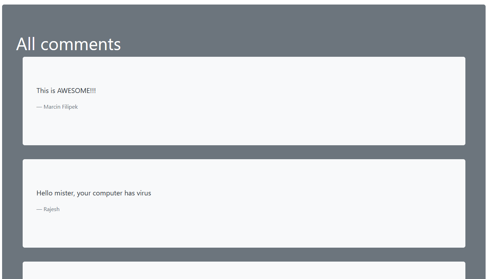

# Przetwarzanie danych w chmurach obliczeniowych - projekt
## Cel projektu
Stworzenie projektu typu POC wykorzystującego grafową bazę danych Neo4J z interfejsem wykorzysującym dowolną technologię internetową 

## Temat
Określanie reprezentatywnego komentarza tworzonego na podstawie wszystkich komentarzy użytkowników dotyczących danego produktu

## Linki do projektu
[Interfejs](https://kerdamon-university-tasks.github.io/Project-PDWCO/) - panel obsługi wyświetlania i dodawania komentarzy udostępniony dzięki GitHub Pages

[Aplikacja serwerowa](https://pdwco-project.herokuapp.com/api/) - REST API hostowane w serwisie heroku

## Opis projektu
Główną funkcją aplikacji jest określanie podsumowania komentarzy wielu użytkowników poprzez stworzenie jednego reprezentatywnego komentarza. Określany jest on na podstawie częstości powiązań pomiędzy słowami w istniejących komentarzach w bazie danych. Stworzony więc komentarz podsumowujący nie jest jednym z komentarzy w bazie danych, jest zbitkiem słów, które najczęściej pojawiają się w tej kombinacji. Może sie więc zdarzyć, że taki komentarz nie istnieje nawet w bazie danch.

W ramach interfejsu użytkownik ma możliwość dodawania nowego komentarza do bazy danych, wyświetlenia komentarza zbiorczego oraz wyświetlenia wszystkich komentarzy wraz z ich autorami.

# Użyta technologia
## Frontend
Interfejs użytkownika jest bardzo prosty. Składa się na niego jeden plik HTML oraz skrypt języka JavaScript obsługujący funkcjonalności interfejsu. Wszystkie dane aktualizowane są dynamicznie na tej jednej stronie, backend odpytywany jest przy użyciu metody fetch. 

## Backend
Aplikacja serwerowa została napisana w języku Python z użyciem frameworka Flask. Backend ma postać REST API, które udostępnia kilka edpointów zwracających dane w postaci plików JSON.

### Endpointy
#### HTTP GET:
- `api/hello-world` - testowy endpoint zwracający wiadomość `hello world!`, w celu sprawdzania, czy połączenie z serwerem działa
- `api/comments` - zwraca wszystkie komentarze zawrate w bazie danych wraz z ich autorami
- `api/representative-comment` - wyznacza oraz zwraca komentarz reprezentatywny na podstawie aktualnych komentarzy znajdujących się w bazie danych
#### HTTP POST:
- `api/comment` - dodaje do bazy danych nowy komentarz. W sekcji body dane powinny mieć postać obiektu z dwoma propercjami: `author` oraz `content`. Przykładowa zawratość sekcji body:
```
{"author": "Konrad Walas", "content": "I really like this TV!"}
```
Aplikacja została wdrożona przy użyciu serwisu Heroku.

## Baza danych
Baza danych użyta w projekcie to oczywiście grafowa baza danych Neo4J. W projekcie jako hosting bazy została użyta AuraDB.

# Opis interfejsu

Rys. 1 Formularz do dodawania nowego komentarza

Należy wpisać zawartość komentarza oraz autora, a następnie kliknąć przycisk send w celu dodania komentarza do bazy danych. Pozostała zawartość strony odświeży się automatycznie i dodany komentarz pojawi się poniżej.


Rys. 2 Komentarz zbiorczy

Tutaj pojawia się komentarz zbiorczy tworzony na podstawie pozostałych komentarzy. Niekiedy trzeba chwilkę poczekać na przetworzenie zapytania i komentarz pojawi się po jakimś czasie.


Rys. 3 Lista wszystkich komentarzy znajdujących się obeznie w bazie danych

Tutaj wyświetlona jest lista wszystkich komentarzy, które obecnie znajdują się w bazie danych. Niekiedy trzeba chwilkę poczekać na załadowanie się wszystkich komentarzy i pojawią się one po jakimś czasie.

# Model danych
W bazie danych znajdują się dwa główne rodzaje nodów:
1. WholeComment - przechodują cały komentarz oraz jego autora. Zawiera property `author` oraz `content`
2. Word - przechoduje pojedyncze słowo ze zdania. Zawiera property `value` określające znaczenie tego słowa

Oraz jeden rodzaj relacji:
1. next - określa powiązania i kolejoność słów

Pierwszy rodzaj węzłów służy do przechowywania całych komentarzy, aby nie trzeba było ich rekonstruować w celu wypisania.

Drugi rodzaj węzłów przechowuje rozbite już komentarze oraz relacje między nimi. Każdy węzeł odpowiada jednemu słowu i występuje w bazie danych tylko raz. 

## Dodawanie nowego komentarza do bazy danych
Przy dodawaniu nowego słowa dzieją się dwie niezależne akcje.
1. Tworzony jest nowy węzeł WholeComment zawierający ten komentarz oraz jego autora. 
2. Zdanie rozbijane jest na pojedyncze słowa, czyszczone ze znaków takich jak ,!. Następnie, jeżeli słowa nie ma jeszcze w bazie danych, to tworzony jest taki węzeł Word. Na samym końcu tworzone są relacje, lub zwiększany jest property count, jeżeli powiązanie już istnieje.


Rys. 4 Przykładowa zawartość bazy danych - węzły word i ich powiązania


# Algorytm wyznaczania komentarza podsumowującego
## Opis działania
1. Wybierz najliczniejsze połączenia (połączenia z największą maksymalną liczbą współczynnika count)
2. Dla każdego połączenia z punktu 1.: 
    1. Znajdź słowo z najlepszym połączeniem z lewej strony (jeżeli istnieje)
    2. Znajdź słowo z najlepszym połączeniem z prawej strony (jeżeli istnieje)
    3. Dołącz słowo, które ma bardziej liczne połączenie
    4. Wykonuj punkty 2.1 - 2.3 do czasu kiedy wszystkie słowa zostaną wykorzystane, lub zostaną tylko połączenia z licznością połowy najliczniejszego połączenia lub mniejszą.


# Źródła
- https://www.datageeks.pl/geeks-blog/23-poglady-sa-jak-pepki-kazdy-ma-swoj
- https://neo4j.com/developer/cypher/
- https://neo4j.com/docs/api/python-driver/current/api.html